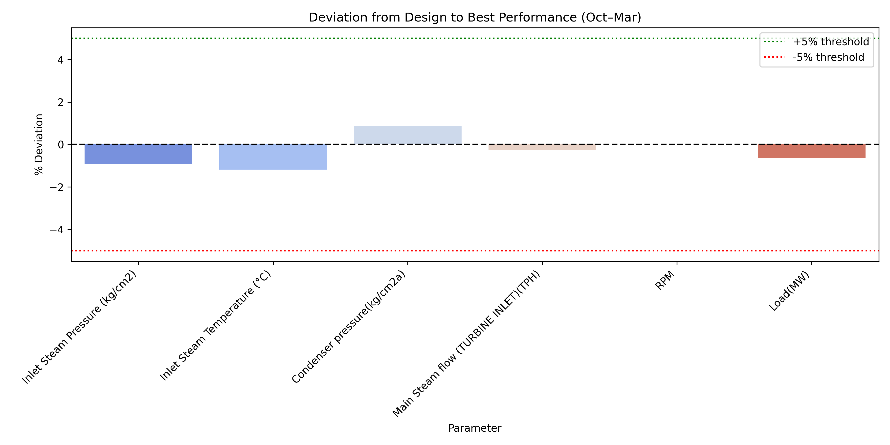
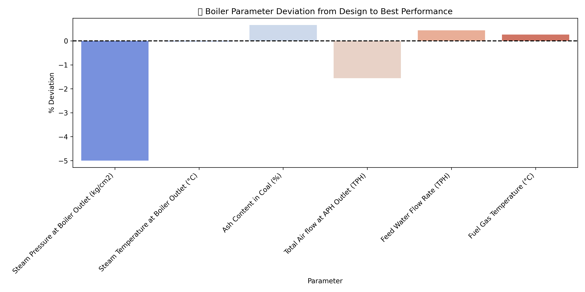

# Power Plant Performance Analysis

Python analysis of boiler and turbine measurements against fixed design values, with charts, exploratory linear forecasts and a rule-based parameter lookup.

## What this project demonstrates

- Loading and cleaning Excel worksheets with pandas.
- Comparing six monthly observations, October 2024 to March 2025, with design values.
- Visualizing parameter deviations and trends.
- Fitting per-parameter linear regressions for exploratory April–September 2025 forecasts.
- Generating template-based recommendations for parameter deviations.

## Example outputs





These are existing repository artifacts; rerunning the scripts should be checked before treating them as regenerated results.

## Setup

Use Python 3.12. Run the commands from the repository root:

```bash
python -m venv .venv
# macOS/Linux
source .venv/bin/activate
# Windows PowerShell: .venv\Scripts\Activate.ps1
python -m pip install -r requirements.txt
python Turbineanalysisandgraphs.py
python Boileranalysisandgraphs.py
python LinearRegressionmodel.py
python AIchatbot.py
```

The analysis scripts open plot windows; close each window to continue. The final command starts an interactive terminal lookup; type `exit` to stop. This repository currently provides scripts, not a Streamlit dashboard.

## Inputs and outputs

| File | Purpose |
| --- | --- |
| `project.xlsx`, sheet `Turbine` | Turbine input measurements |
| `Boiler.xlsx`, sheet `Boiler` | Boiler input measurements |
| `Turbineanalysisandgraphs.py` | Turbine analysis, charts and printed table |
| `Boileranalysisandgraphs.py` | Boiler analysis and charts |
| `analysis.py` | Validated loading, deviation calculations and forecast functions |
| `LinearRegressionmodel.py` | Printed and exported linear forecasts |
| `sql_pipeline.py` | SQLite ingestion and SQL report export |
| `AIchatbot.py` | Rule-based terminal parameter lookup |

The shared loader strips column whitespace, validates required column names and converts numeric values. Input workbooks use a one-row header offset. The forecasting script writes fresh exports to `outputs/Turbine_Linear_Forecast.xlsx` and `outputs/Boiler_Linear_Forecast.xlsx`; the original root-level spreadsheets remain historical artifacts.

## Method and interpretation

The analysis selects the available monthly value closest to the design value and computes `100 * (selected - design) / design`. This is a best-observed deviation, not average operating performance or a thermodynamic efficiency calculation. The terminal lookup uses the workbook's `Performance` column, so its result can differ from the analysis scripts.

The analysis flags absolute deviations above 5%; the lookup uses a 0.5% generic threshold. These are prototype choices rather than validated equipment-specific operating limits. Recommendations are deterministic text templates; no GPT or LLM service is called.

## Limitations and next steps

- Six monthly observations are insufficient evidence for dependable six-month forecasts. No holdout accuracy or measured business savings are established here.
- Forecasting preserves actual month positions when observations are missing and requires at least three finite observations.
- Zero design values produce undefined deviations rather than infinite values. Missing observations remain unknown.
- Plot parameters separately or normalize them before comparing different physical units.
- Add a last-observation baseline and time-based evaluation with more observations.
- Document the source and publication permission of each workbook; use clearly labelled synthetic data for a public demo if permission is unavailable.

This portfolio analysis does not establish operating instructions or measured downtime reductions.

## SQL analytics

[Explore the SQL case study](sql/README.md): normalized tables, joins, CTEs, window functions, month-over-month changes and data-quality checks.

```bash
python sql_pipeline.py
python -m unittest discover -s tests -v
```

The bundled snapshot contains 12 parameters across two equipment categories and six months: 72 measurement rows. It is a small analytical example, not a production-scale system. Generated SQLite and CSV outputs are saved under `outputs/` and excluded from version control.

Tests check missing-month forecasting, undefined deviations, non-mutating summaries, workbook loading, idempotent SQL ingestion, deterministic ranking and null baselines. Direct dependencies are pinned to versions used for local validation on Python 3.12.
